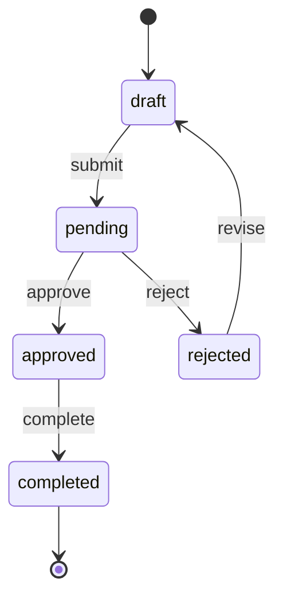

# State Machine Designer Skill

Model complex entity lifecycles with clear states, transitions, and guards.

## State Machine Template

```markdown
## State Machine: [Entity] (e.g., Order)

### States
| State | Description | Entry Action |
|-------|-------------|-------------|
| draft | Initial state, not submitted | — |
| pending | Submitted, awaiting review | Send notification to reviewer |
| approved | Reviewed and approved | Send approval email |
| rejected | Reviewed and rejected | Send rejection email with reason |
| completed | Work finished | Update metrics dashboard |

### Transitions
| From | To | Trigger | Guard Condition | Side Effect |
|------|-----|---------|----------------|-------------|
| draft | pending | user.submit() | All required fields filled | Notify reviewer |
| pending | approved | reviewer.approve() | Reviewer has permission | Send email |
| pending | rejected | reviewer.reject(reason) | Reason is not empty | Send email |
| approved | completed | system.markComplete() | All tasks done | Update metrics |
| rejected | draft | user.revise() | — | Clear rejection |

### Diagram (Mermaid)

```
