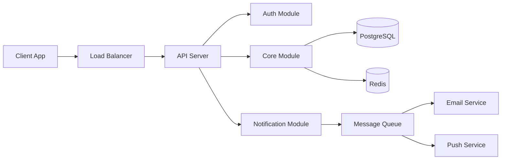

# System Architect Skill

Design production-grade system architecture with clear diagrams and rationale.

## Architecture Decision Process

1. **Understand the constraints** — scale, team size, timeline, budget
2. **Choose the pattern** — monolith, modular monolith, microservices, serverless
3. **Define module boundaries** — by domain, by team, by deployment unit
4. **Design data flow** — request lifecycle, event flow, data pipeline
5. **Plan infrastructure** — hosting, databases, caches, CDN, monitoring
6. **Document decisions** — ADRs with rationale

## Pattern Selection Guide

| Factor | Monolith | Modular Monolith | Microservices | Serverless |
|--------|----------|------------------|---------------|------------|
| Team Size | 1-5 | 3-15 | 10+ | 1-10 |
| Timeline | Fast MVP | Balanced | Long-term | Fast + scalable |
| Complexity | Low-Med | Medium | High | Medium |
| Scale | Thousands | Tens of thousands | Millions | Variable |
| Deploy | Simple | Simple | Complex | Auto |
| Cost | Low | Low-Med | High | Pay-per-use |

**Default recommendation:** Start with **Modular Monolith** unless you have a specific reason not to. You can extract microservices later.

## Architecture Document Template

```markdown
# [Project] — Architecture

## System Overview
[High-level description]

## Architecture Diagram


## Module Boundaries
| Module | Responsibility | Dependencies | Data Ownership |
|--------|---------------|-------------|----------------|
| Auth | Authentication, authorization, sessions | None | users, sessions |
| Core | Business logic, CRUD operations | Auth | [entities] |
| Notify | Email, push, SMS notifications | Core | notifications |

## Data Flow
### Request Lifecycle
1. Client sends request → Load Balancer
2. LB routes to API Server
3. Auth middleware validates JWT
4. Route handler delegates to service
5. Service executes business logic
6. Repository queries database
7. Response returned to client

## Infrastructure
| Component | Technology | Hosting | Purpose |
|-----------|-----------|---------|---------|
| API | [framework] | [platform] | Request handling |
| Database | PostgreSQL 16 | [provider] | Primary data store |
| Cache | Redis 7 | [provider] | Session + query cache |
| CDN | [provider] | Edge | Static assets |
| CI/CD | GitHub Actions | GitHub | Build + deploy |

## Scaling Strategy
- **Vertical:** Increase instance size for immediate relief
- **Horizontal:** Add instances behind load balancer
- **Database:** Read replicas for read-heavy workloads
- **Cache:** Redis cluster for session + query caching
- **Queue:** Message queue for async operations
```

## Architecture Decision Record (ADR) Template
```markdown
# ADR-[NNN]: [Title]
**Status:** Proposed | Accepted | Deprecated | Superseded
**Date:** [YYYY-MM-DD]
**Context:** [What is the issue?]
**Decision:** [What was decided]
**Rationale:** [Why this option over alternatives]
**Alternatives Considered:**
1. [Option A] — [why rejected]
2. [Option B] — [why rejected]
**Consequences:**
- [Positive consequence]
- [Negative consequence / trade-off]
```
