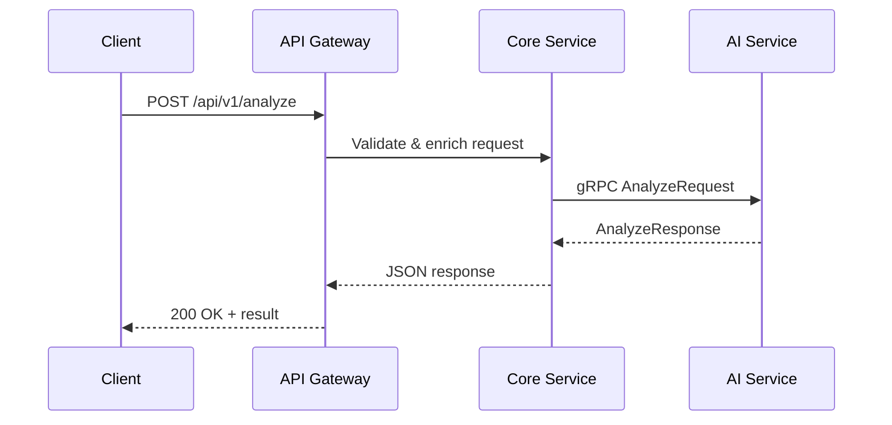
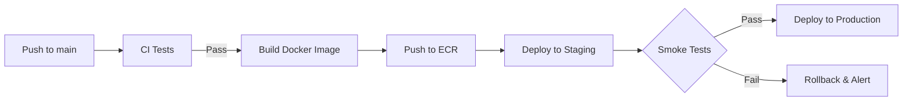
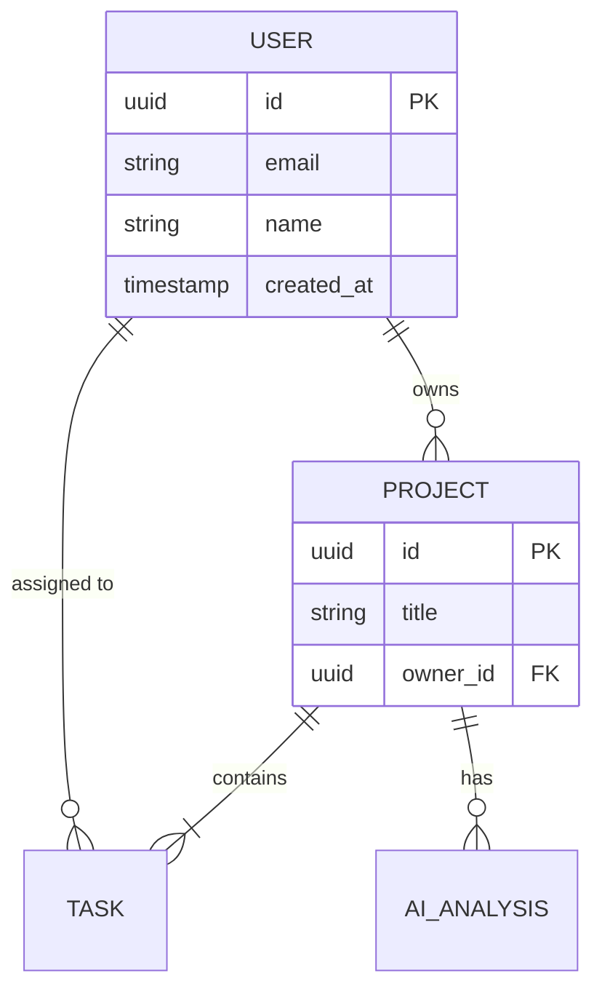

# Technical Writer Skill

Write clear, structured technical documentation for this microservices project, including architecture decision records, runbooks, API references, and onboarding guides.

## When to Use

- Creating or updating architecture decision records (ADRs)
- Writing deployment runbooks or incident response procedures
- Drafting onboarding guides for new developers
- Documenting API endpoints, data models, or integration flows
- Adding Mermaid diagrams to explain system behavior

## Document Types

| Type | Location | Audience |
|------|----------|----------|
| README | Root and per-service | All developers |
| API Reference | `docs/api/` or Swagger | Frontend + external consumers |
| Architecture Decision Record (ADR) | `docs/adr/` | Team leads, architects |
| Deployment Runbook | `docs/runbooks/` | DevOps, on-call engineers |
| Onboarding Guide | `docs/onboarding.md` | New team members |

## ADR Format (MADR Template)

Use this structure for every architecture decision:

```markdown
# ADR-NNN: Title of Decision

## Status

Accepted | Deprecated | Superseded by ADR-NNN

## Context

What is the issue we are facing? What forces are at play?

## Decision

What is the change we are making? State it in active voice.

## Consequences

### Positive
- Benefit one
- Benefit two

### Negative
- Trade-off one
- Trade-off two

### Neutral
- Side effect that is neither good nor bad
```

Example filename: `docs/adr/003-use-prisma-over-typeorm.md`

## Runbook Format

```markdown
# Runbook: Deploy Core Service to Production

## Purpose

Step-by-step guide for deploying the core-service to the production ECS cluster.

## Prerequisites

- AWS CLI configured with production credentials
- Access to the `prod` ECS cluster
- Latest Docker image built and pushed to ECR

## Steps

1. Verify the CI pipeline passed on the `main` branch.
2. Tag the release: `git tag v1.x.x && git push --tags`
3. Trigger the deployment workflow:
   ```bash
   gh workflow run deploy.yml -f environment=production -f tag=v1.x.x
   ```
4. Monitor the ECS service for healthy task count:
   ```bash
   aws ecs describe-services --cluster prod --services core-service
   ```
5. Verify health check endpoint returns 200:
   ```bash
   curl -f https://api.example.com/health
   ```

## Rollback

1. Revert to previous task definition:
   ```bash
   aws ecs update-service --cluster prod --service core-service \
     --task-definition core-service:PREVIOUS_REVISION
   ```
2. Verify rollback health check.
3. Notify the team in #incidents.

## Monitoring

- CloudWatch dashboard: [link]
- Grafana alerts: [link]
- On-call rotation: PagerDuty schedule [link]
```

## Writing Guidelines

Follow these rules for all documentation:

- **Active voice**: "The service processes requests" not "Requests are processed by the service"
- **Present tense**: "This command starts the server" not "This command will start the server"
- **Second person**: "You configure the database" not "The developer configures the database"
- **Short sentences**: Aim for under 25 words per sentence
- **One idea per paragraph**: Break up dense paragraphs into lists or sub-sections
- **Concrete examples**: Show a command, code snippet, or screenshot for every concept

## Mermaid Diagrams

Use Mermaid in Markdown for architecture visualization. Always include a text description alongside the diagram for accessibility.

### Sequence diagram (service communication)



### Flowchart (deployment pipeline)



### ER diagram (data model)



## Code Examples in Documentation

Always include the language tag on fenced code blocks. When illustrating a pattern, show both correct and incorrect usage:

```typescript
// BAD: catches error but swallows it silently
try {
  await this.usersService.create(dto);
} catch (error) {
  // do nothing
}

// GOOD: log the error and re-throw or return a meaningful response
try {
  await this.usersService.create(dto);
} catch (error) {
  this.logger.error('Failed to create user', error.stack);
  throw new InternalServerErrorException('User creation failed');
}
```

## Anti-Patterns

- **Outdated documentation** -- treat docs as code; update them in the same PR that changes behavior
- **No table of contents for long docs** -- add a TOC for any document over 100 lines
- **Screenshots without alt text** -- always provide descriptive alt text for images
- **Documentation separate from code** -- keep docs close to the code they describe (co-locate)
- **Jargon without definition** -- define acronyms and domain terms on first use
- **Missing runbook rollback section** -- every deployment runbook must include rollback steps
- **Diagrams without text explanation** -- always pair a Mermaid diagram with a prose summary

## Checklist

- [ ] Document has a clear title and one-line purpose statement
- [ ] Correct document type and template used (ADR, runbook, guide)
- [ ] Active voice, present tense, second person throughout
- [ ] Code examples include language tags and show correct vs. incorrect usage
- [ ] Mermaid diagrams have accompanying text descriptions
- [ ] Long documents include a table of contents
- [ ] No stale information -- all commands and URLs verified
- [ ] Acronyms defined on first use
- [ ] Reviewed by at least one team member before merging
