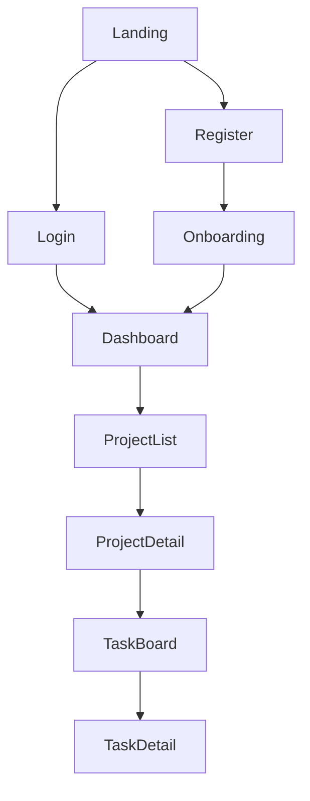

# UI Wireframes Skill

Create structured UI specifications that agents can implement directly.

## Screen Layout Template
```markdown
## Screen: [Name] (/route/path)
**Purpose:** [What user does here]
**Auth:** Required | Public
**Layout:** Dashboard | Auth | Full-width

### Wireframe
```
┌─────────────────────────────────────────┐
│  Logo    [Nav Item] [Nav Item]  [Avatar]│ ← Header
├────────┬────────────────────────────────┤
│        │                                │
│ [Link] │  Page Title           [+ New]  │
│ [Link] │  ─────────────────────────     │
│ [Link] │  ┌──────┐ ┌──────┐ ┌──────┐   │
│ [Link] │  │Card 1│ │Card 2│ │Card 3│   │
│        │  └──────┘ └──────┘ └──────┘   │
│        │                                │
│Sidebar │  Content Area                  │
└────────┴────────────────────────────────┘
```

### Components on This Screen
| Component | Data Source | Actions |
|-----------|-----------|---------|
| Header | auth context | logout, profile |
| Sidebar | navigation config | route change |
| Card Grid | GET /api/items | click → detail page |
| New Button | — | opens create modal |

### States
- **Loading:** Skeleton cards (3 placeholders)
- **Empty:** "No items yet. Create your first one!" + CTA
- **Error:** Toast notification with retry button
- **Mobile:** Sidebar collapses to hamburger menu
```

## Navigation Flow (Mermaid)

