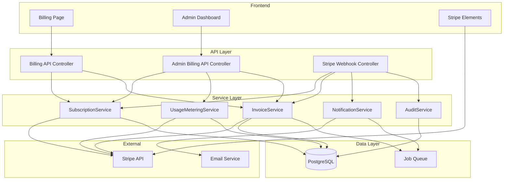
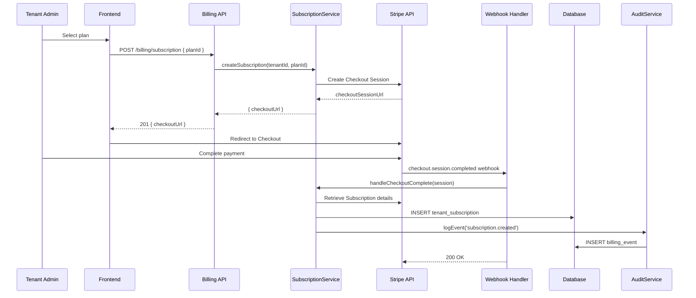
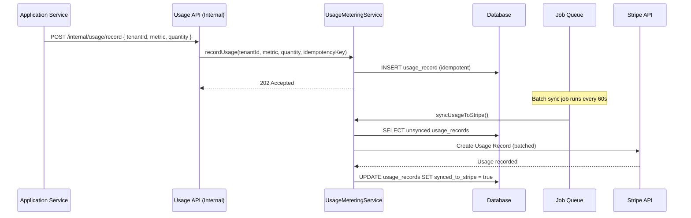
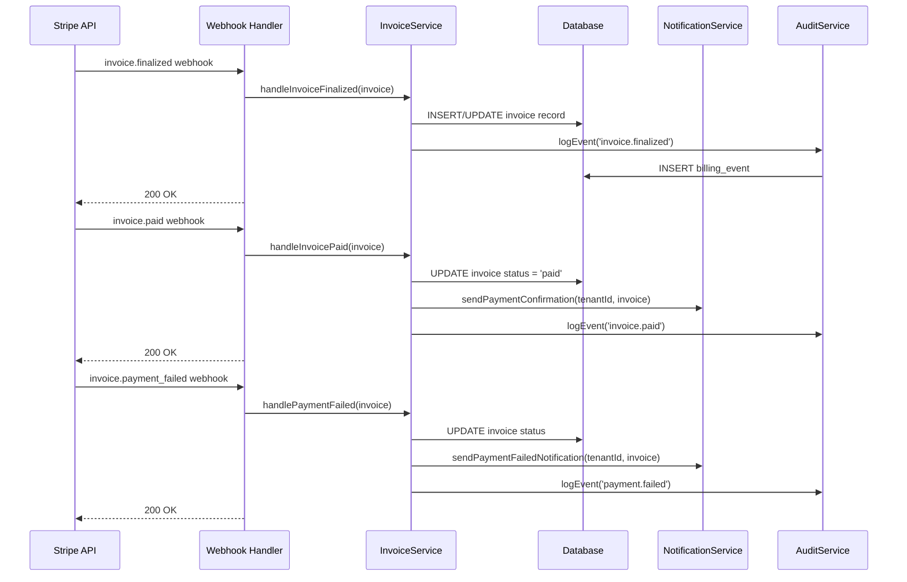

# Design: Multi-Tenant Billing System

## Architecture



## API Endpoints

### Tenant Billing Endpoints

| Method | Path | Request Body | Response | Auth |
|--------|------|-------------|----------|------|
| GET | /api/v1/billing/plans | - | 200: { plans: [{ id, name, price, interval, features, usageLimits }] } | JWT |
| GET | /api/v1/billing/subscription | - | 200: { subscription: { planId, status, currentPeriodEnd, cancelAtPeriodEnd } } | JWT + Tenant |
| POST | /api/v1/billing/subscription | { planId, billingCycle } | 201: { checkoutUrl } | JWT + Tenant Admin |
| PATCH | /api/v1/billing/subscription | { planId } | 200: { subscription, prorationPreview } | JWT + Tenant Admin |
| DELETE | /api/v1/billing/subscription | - | 200: { canceledAt, effectiveDate } | JWT + Tenant Admin |
| GET | /api/v1/billing/usage | ?period=current | 200: { usage: [{ metric, quantity, limit, unit }] } | JWT + Tenant |
| GET | /api/v1/billing/invoices | ?page=1&limit=20 | 200: { invoices: [{ id, date, total, status, pdfUrl }], pagination } | JWT + Tenant |
| GET | /api/v1/billing/invoices/:id/pdf | - | 200: application/pdf | JWT + Tenant |
| GET | /api/v1/billing/payment-methods | - | 200: { paymentMethods: [{ id, brand, last4, expMonth, expYear, isDefault }] } | JWT + Tenant Admin |
| POST | /api/v1/billing/payment-methods | { stripePaymentMethodId } | 201: { paymentMethod } | JWT + Tenant Admin |
| PATCH | /api/v1/billing/payment-methods/:id/default | - | 200: { paymentMethod } | JWT + Tenant Admin |
| DELETE | /api/v1/billing/payment-methods/:id | - | 204 | JWT + Tenant Admin |

### Usage Metering Endpoint (Internal)

| Method | Path | Request Body | Response | Auth |
|--------|------|-------------|----------|------|
| POST | /api/v1/internal/usage/record | { tenantId, metric, quantity, timestamp, idempotencyKey } | 202: { recorded: true } | Service API Key |

### Admin Billing Endpoints

| Method | Path | Request Body | Response | Auth |
|--------|------|-------------|----------|------|
| GET | /api/v1/admin/billing/dashboard | - | 200: { mrr, arr, churnRate, activeCount, trialCount, failedPayments } | JWT + Platform Admin |
| GET | /api/v1/admin/billing/tenants | ?plan=pro&status=active&page=1 | 200: { tenants: [{ id, name, plan, mrr, status }], pagination } | JWT + Platform Admin |
| GET | /api/v1/admin/billing/tenants/:id | - | 200: { tenant, subscription, usage, invoices, paymentHistory } | JWT + Platform Admin |
| POST | /api/v1/admin/billing/tenants/:id/credits | { amount, reason } | 201: { credit, newBalance } | JWT + Platform Admin |
| POST | /api/v1/admin/billing/tenants/:id/adjustments | { amount, reason, type } | 201: { adjustment } | JWT + Platform Admin |
| GET | /api/v1/admin/billing/plans | - | 200: { plans: [] } | JWT + Platform Admin |
| POST | /api/v1/admin/billing/plans | { name, price, interval, features, usageLimits } | 201: { plan } | JWT + Platform Admin |
| PATCH | /api/v1/admin/billing/plans/:id | { name?, price?, features?, usageLimits? } | 200: { plan } | JWT + Platform Admin |
| GET | /api/v1/admin/billing/failed-payments | ?page=1&limit=20 | 200: { failedPayments: [{ tenantId, amount, failureReason, attempts, lastAttempt }] } | JWT + Platform Admin |
| POST | /api/v1/admin/billing/failed-payments/:id/retry | - | 200: { retryResult } | JWT + Platform Admin |

### Stripe Webhook Endpoint

| Method | Path | Request Body | Response | Auth |
|--------|------|-------------|----------|------|
| POST | /api/v1/webhooks/stripe | Stripe Event (raw body) | 200: { received: true } | Stripe Signature |

## Data Model

### billing_plans
```sql
CREATE TABLE billing_plans (
    id UUID PRIMARY KEY DEFAULT gen_random_uuid(),
    stripe_product_id VARCHAR(255) UNIQUE NOT NULL,
    stripe_price_id VARCHAR(255) UNIQUE NOT NULL,
    name VARCHAR(100) NOT NULL,
    slug VARCHAR(50) UNIQUE NOT NULL,
    description TEXT,
    price_cents INTEGER NOT NULL,
    billing_interval VARCHAR(20) NOT NULL CHECK (billing_interval IN ('month', 'year')),
    features JSONB NOT NULL DEFAULT '{}',
    usage_limits JSONB NOT NULL DEFAULT '{}',
    is_active BOOLEAN NOT NULL DEFAULT true,
    sort_order INTEGER NOT NULL DEFAULT 0,
    created_at TIMESTAMPTZ NOT NULL DEFAULT NOW(),
    updated_at TIMESTAMPTZ NOT NULL DEFAULT NOW()
);

CREATE INDEX idx_billing_plans_slug ON billing_plans(slug);
CREATE INDEX idx_billing_plans_active ON billing_plans(is_active);
```

### tenant_subscriptions
```sql
CREATE TABLE tenant_subscriptions (
    id UUID PRIMARY KEY DEFAULT gen_random_uuid(),
    tenant_id UUID NOT NULL REFERENCES tenants(id),
    plan_id UUID NOT NULL REFERENCES billing_plans(id),
    stripe_subscription_id VARCHAR(255) UNIQUE NOT NULL,
    stripe_customer_id VARCHAR(255) NOT NULL,
    status VARCHAR(30) NOT NULL CHECK (status IN ('trialing', 'active', 'past_due', 'paused', 'canceled', 'unpaid')),
    current_period_start TIMESTAMPTZ NOT NULL,
    current_period_end TIMESTAMPTZ NOT NULL,
    cancel_at_period_end BOOLEAN NOT NULL DEFAULT false,
    canceled_at TIMESTAMPTZ,
    trial_end TIMESTAMPTZ,
    created_at TIMESTAMPTZ NOT NULL DEFAULT NOW(),
    updated_at TIMESTAMPTZ NOT NULL DEFAULT NOW(),
    UNIQUE(tenant_id)
);

CREATE INDEX idx_tenant_subscriptions_tenant ON tenant_subscriptions(tenant_id);
CREATE INDEX idx_tenant_subscriptions_status ON tenant_subscriptions(status);
CREATE INDEX idx_tenant_subscriptions_stripe_sub ON tenant_subscriptions(stripe_subscription_id);
CREATE INDEX idx_tenant_subscriptions_stripe_cust ON tenant_subscriptions(stripe_customer_id);
```

### usage_records
```sql
CREATE TABLE usage_records (
    id UUID PRIMARY KEY DEFAULT gen_random_uuid(),
    tenant_id UUID NOT NULL REFERENCES tenants(id),
    metric VARCHAR(50) NOT NULL,
    quantity BIGINT NOT NULL,
    idempotency_key VARCHAR(255) NOT NULL,
    recorded_at TIMESTAMPTZ NOT NULL DEFAULT NOW(),
    synced_to_stripe BOOLEAN NOT NULL DEFAULT false,
    stripe_usage_record_id VARCHAR(255),
    created_at TIMESTAMPTZ NOT NULL DEFAULT NOW(),
    UNIQUE(idempotency_key)
);

CREATE INDEX idx_usage_records_tenant_metric ON usage_records(tenant_id, metric);
CREATE INDEX idx_usage_records_recorded ON usage_records(recorded_at);
CREATE INDEX idx_usage_records_unsynced ON usage_records(synced_to_stripe) WHERE synced_to_stripe = false;
```

### invoices
```sql
CREATE TABLE invoices (
    id UUID PRIMARY KEY DEFAULT gen_random_uuid(),
    tenant_id UUID NOT NULL REFERENCES tenants(id),
    stripe_invoice_id VARCHAR(255) UNIQUE NOT NULL,
    number VARCHAR(50),
    status VARCHAR(30) NOT NULL CHECK (status IN ('draft', 'open', 'paid', 'void', 'uncollectible')),
    amount_due_cents INTEGER NOT NULL,
    amount_paid_cents INTEGER NOT NULL DEFAULT 0,
    tax_cents INTEGER NOT NULL DEFAULT 0,
    total_cents INTEGER NOT NULL,
    currency VARCHAR(3) NOT NULL DEFAULT 'usd',
    line_items JSONB NOT NULL DEFAULT '[]',
    pdf_url TEXT,
    hosted_invoice_url TEXT,
    period_start TIMESTAMPTZ NOT NULL,
    period_end TIMESTAMPTZ NOT NULL,
    due_date TIMESTAMPTZ,
    paid_at TIMESTAMPTZ,
    created_at TIMESTAMPTZ NOT NULL DEFAULT NOW(),
    updated_at TIMESTAMPTZ NOT NULL DEFAULT NOW()
);

CREATE INDEX idx_invoices_tenant ON invoices(tenant_id);
CREATE INDEX idx_invoices_status ON invoices(status);
CREATE INDEX idx_invoices_stripe ON invoices(stripe_invoice_id);
CREATE INDEX idx_invoices_created ON invoices(created_at DESC);
```

### payment_methods
```sql
CREATE TABLE payment_methods (
    id UUID PRIMARY KEY DEFAULT gen_random_uuid(),
    tenant_id UUID NOT NULL REFERENCES tenants(id),
    stripe_payment_method_id VARCHAR(255) UNIQUE NOT NULL,
    type VARCHAR(30) NOT NULL DEFAULT 'card',
    card_brand VARCHAR(20),
    card_last4 VARCHAR(4),
    card_exp_month INTEGER,
    card_exp_year INTEGER,
    is_default BOOLEAN NOT NULL DEFAULT false,
    created_at TIMESTAMPTZ NOT NULL DEFAULT NOW(),
    updated_at TIMESTAMPTZ NOT NULL DEFAULT NOW()
);

CREATE INDEX idx_payment_methods_tenant ON payment_methods(tenant_id);
```

### billing_events (audit log)
```sql
CREATE TABLE billing_events (
    id UUID PRIMARY KEY DEFAULT gen_random_uuid(),
    tenant_id UUID REFERENCES tenants(id),
    event_type VARCHAR(100) NOT NULL,
    stripe_event_id VARCHAR(255) UNIQUE,
    actor_id UUID,
    actor_type VARCHAR(20) CHECK (actor_type IN ('user', 'admin', 'system', 'stripe')),
    metadata JSONB NOT NULL DEFAULT '{}',
    created_at TIMESTAMPTZ NOT NULL DEFAULT NOW()
);

CREATE INDEX idx_billing_events_tenant ON billing_events(tenant_id);
CREATE INDEX idx_billing_events_type ON billing_events(event_type);
CREATE INDEX idx_billing_events_created ON billing_events(created_at DESC);
CREATE INDEX idx_billing_events_stripe ON billing_events(stripe_event_id);
```

### admin_credits
```sql
CREATE TABLE admin_credits (
    id UUID PRIMARY KEY DEFAULT gen_random_uuid(),
    tenant_id UUID NOT NULL REFERENCES tenants(id),
    admin_id UUID NOT NULL,
    amount_cents INTEGER NOT NULL,
    reason TEXT NOT NULL,
    type VARCHAR(20) NOT NULL CHECK (type IN ('credit', 'adjustment', 'refund')),
    stripe_credit_note_id VARCHAR(255),
    created_at TIMESTAMPTZ NOT NULL DEFAULT NOW()
);

CREATE INDEX idx_admin_credits_tenant ON admin_credits(tenant_id);
```

## Component Structure

### Billing Pages (Tenant-Facing)
```
src/app/billing/
  layout.tsx                    -- Billing section layout with sidebar nav
  page.tsx                      -- Subscription overview (current plan, usage summary)
  plans/
    page.tsx                    -- Plan comparison and selection
  usage/
    page.tsx                    -- Usage breakdown with charts
  invoices/
    page.tsx                    -- Invoice history list
    [id]/
      page.tsx                  -- Invoice detail view
  payment-methods/
    page.tsx                    -- Manage payment methods

src/components/billing/
  PlanCard.tsx                  -- Individual plan display with features list
  PlanComparison.tsx            -- Side-by-side plan comparison table
  SubscriptionStatus.tsx        -- Current subscription badge and details
  UsageBar.tsx                  -- Progress bar for usage against limits
  UsageChart.tsx                -- Time-series usage chart
  InvoiceTable.tsx              -- Paginated invoice list
  InvoiceLineItems.tsx          -- Line item breakdown for a single invoice
  PaymentMethodCard.tsx         -- Card display (brand, last4, expiry)
  PaymentMethodForm.tsx         -- Stripe Elements card input form
  ProrationPreview.tsx          -- Shows cost difference for plan change
  BillingAlert.tsx              -- Usage threshold and payment failure alerts
```

### Admin Dashboard Components
```
src/app/admin/billing/
  page.tsx                      -- Dashboard with KPI cards and charts
  tenants/
    page.tsx                    -- Tenant list with filters
    [id]/
      page.tsx                  -- Tenant billing detail
  plans/
    page.tsx                    -- Plan management (CRUD)
  failed-payments/
    page.tsx                    -- Failed payment queue

src/components/admin/billing/
  RevenueKPICards.tsx           -- MRR, ARR, churn, active count
  RevenueChart.tsx              -- MRR trend over time
  TenantBillingTable.tsx        -- Filterable tenant list
  TenantBillingDetail.tsx       -- Full tenant billing view
  PlanEditor.tsx                -- Create/edit plan form
  FailedPaymentQueue.tsx        -- Failed payment list with retry actions
  CreditAdjustmentForm.tsx     -- Apply credits/adjustments to tenant
  ChurnChart.tsx                -- Churn rate visualization
```

## Sequence Diagram

### Subscription Creation Flow


### Usage Metering Flow


### Invoice Generation Flow


## Error Handling

| Scenario | Handling Strategy |
|----------|------------------|
| Stripe API timeout | Retry with exponential backoff (3 attempts, 1s/2s/4s). Return 503 to client with retry-after header. |
| Stripe webhook signature invalid | Return 400 immediately. Log as security event. Do not process. |
| Duplicate webhook event | Idempotent processing -- check stripe_event_id in billing_events table. Return 200 if already processed. |
| Checkout session expired | Return user to plan selection with message. No subscription created. |
| Payment method declined | Store failure reason from Stripe. Notify tenant admin with specific decline code explanation. |
| Usage metering burst | Buffer writes in memory, batch insert every 5 seconds. Drop to async queue if DB is under load. |
| Invoice PDF generation fails | Queue for retry. Serve Stripe-hosted invoice URL as fallback. Log alert for ops. |
| Tenant subscription not found | Return 404 with redirect to plan selection page. Do not expose internal IDs. |
| Plan downgrade with limit violation | Return 409 Conflict with list of resources that exceed the target plan's limits. |
| Webhook processing exceeds 5s | Acknowledge webhook immediately (200), process asynchronously via job queue. |
| Stripe customer creation fails | Retry once. If still fails, return 500 with user-friendly message. Alert ops. |
| Race condition on plan change | Use database advisory locks on tenant_id for subscription mutations. |

## Migration Strategy

### Database Migrations
1. Create `billing_plans` table and seed with initial plan data (Free, Starter, Pro, Enterprise)
2. Create `tenant_subscriptions` table with foreign key to tenants
3. Create `usage_records` table with partitioning by month on `recorded_at`
4. Create `invoices` table
5. Create `payment_methods` table
6. Create `billing_events` audit log table
7. Create `admin_credits` table
8. Add `stripe_customer_id` column to existing `tenants` table (nullable, populated on first billing interaction)

### Stripe Setup
1. Create Products and Prices in Stripe for each plan tier
2. Configure Stripe webhooks for: checkout.session.completed, customer.subscription.created, customer.subscription.updated, customer.subscription.deleted, invoice.finalized, invoice.paid, invoice.payment_failed, payment_method.attached, payment_method.detached
3. Set up Stripe usage-based metering for tracked metrics
4. Configure Stripe dunning rules (retry schedule: 1, 3, 7 days)

### Rollout Strategy
1. Deploy database migrations (backward compatible -- all new tables)
2. Deploy Stripe webhook handler (can receive events before UI is live)
3. Deploy billing API endpoints behind feature flag
4. Deploy tenant billing UI behind feature flag
5. Enable for internal/beta tenants first
6. Monitor webhook processing and error rates for 48 hours
7. Enable for all tenants
8. Deploy admin dashboard
