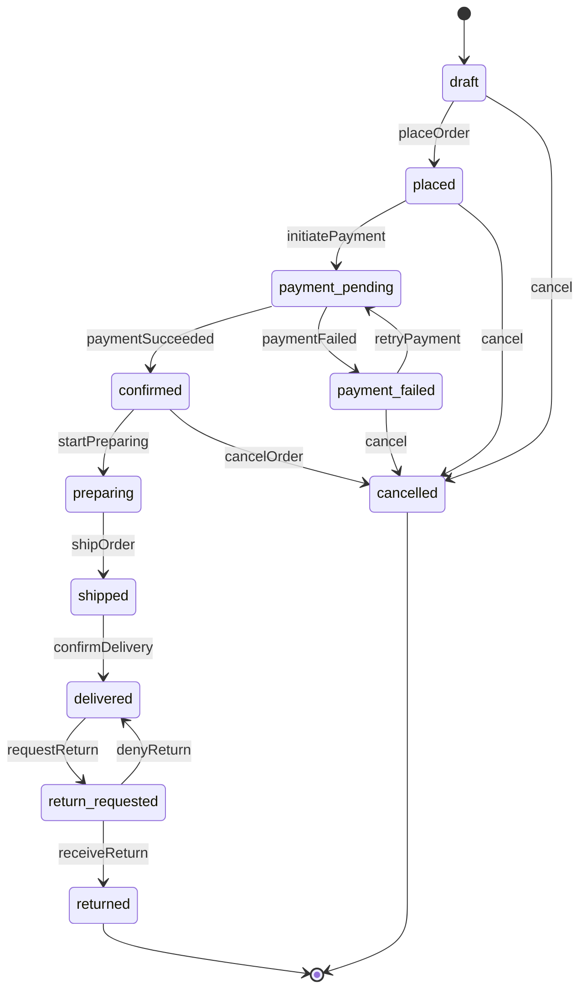

# State Machine: Order

## States

| State | Description | Entry Action | Terminal? |
|-------|-------------|-------------|-----------|
| draft | Order created but not yet placed by customer | -- | No |
| placed | Customer submitted the order | Send order confirmation email, create audit log | No |
| payment_pending | Awaiting payment processing from payment gateway | Initiate payment charge via gateway | No |
| payment_failed | Payment was declined or errored | Send payment failure notification to customer | No |
| confirmed | Payment succeeded, order is confirmed | Send payment receipt, notify warehouse, create audit log | No |
| preparing | Warehouse is picking and packing the order | Notify warehouse staff, update estimated delivery | No |
| shipped | Order handed off to carrier | Send shipping confirmation with tracking number | No |
| delivered | Order received by customer | Send delivery confirmation email | No |
| return_requested | Customer requested a return | Send return instructions email, create return label | No |
| returned | Return received and processed | Issue refund, update inventory, send refund confirmation | Yes |
| cancelled | Order was cancelled before delivery | Release reserved inventory, issue refund if paid, send cancellation email | Yes |

## Transitions

| # | From | To | Trigger | Guard | Side Effects |
|---|------|----|---------|-------|-------------|
| 1 | draft | placed | customer.placeOrder() | Cart is non-empty AND shipping address is valid | Send confirmation email, reserve inventory, create audit log |
| 2 | draft | cancelled | customer.cancel() | -- | Create audit log |
| 3 | placed | payment_pending | system.initiatePayment() | Payment method is attached to order | Create payment intent with gateway, create audit log |
| 4 | placed | cancelled | customer.cancel() | -- | Release reserved inventory, create audit log |
| 5 | payment_pending | confirmed | gateway.paymentSucceeded() | Payment amount matches order total | Record payment ID, send receipt email, notify warehouse, create audit log |
| 6 | payment_pending | payment_failed | gateway.paymentFailed() | -- | Record failure reason, send payment failure email, create audit log |
| 7 | payment_failed | payment_pending | customer.retryPayment() | Payment method is attached to order | Create new payment intent with gateway, create audit log |
| 8 | payment_failed | cancelled | customer.cancel() | -- | Release reserved inventory, create audit log |
| 9 | confirmed | preparing | warehouse.startPreparing() | At least one item in stock | Assign picker, update estimated ship date, create audit log |
| 10 | confirmed | cancelled | admin.cancelOrder(reason) | reason.length > 0 | Release reserved inventory, issue refund (idempotency key), send cancellation email, create audit log |
| 11 | preparing | shipped | warehouse.shipOrder(trackingNumber) | trackingNumber is non-empty | Send shipping email with tracking, update carrier records, create audit log |
| 12 | shipped | delivered | carrier.confirmDelivery() | Delivery proof exists (signature or photo) | Send delivery confirmation email, create audit log |
| 13 | delivered | return_requested | customer.requestReturn(reason) | Return window has not expired (within 30 days) AND reason.length > 0 | Send return instructions email, generate return label, create audit log |
| 14 | return_requested | returned | warehouse.receiveReturn() | Return items inspected and accepted | Issue refund (idempotency key), update inventory, send refund confirmation, create audit log |
| 15 | return_requested | delivered | admin.denyReturn(reason) | reason.length > 0 | Send return denial email with reason, create audit log |

## Mermaid Diagram

## Validation Checklist

| # | Check | Result |
|---|-------|--------|
| 1 | No orphan states | PASS -- all 11 states appear as From or To in at least one transition |
| 2 | All transitions have source + target | PASS -- all 15 transitions have non-empty From and To |
| 3 | At least one terminal state | PASS -- 2 terminal states: returned, cancelled |
| 4 | Reachability | PASS -- all states reachable from draft (draft->placed->payment_pending->confirmed->preparing->shipped->delivered->return_requested->returned; payment_pending->payment_failed; draft->cancelled) |
| 5 | No dead ends (unless terminal) | PASS -- every non-terminal state has at least one outgoing transition |
| 6 | Guards are testable | PASS -- all guards use context data (cart contents, address, payment method, amounts, tracking, dates, reasons) with no external API calls |
| 7 | Side effects are idempotent | PASS -- emails use idempotency keys, refunds use idempotency keys, inventory operations are idempotent (reserve/release by order ID) |
| 8 | Mermaid matches table | PASS -- 15 transitions in both diagram and table, 11 states in both, 2 terminal states point to [*] |

## Error Handling

Side effects execute after the guard passes but before the state is persisted. If any side effect fails, the transition rolls back and the state remains unchanged. The caller receives an error and can retry the transition. Idempotency keys on emails and refunds ensure retries do not cause duplicates.
