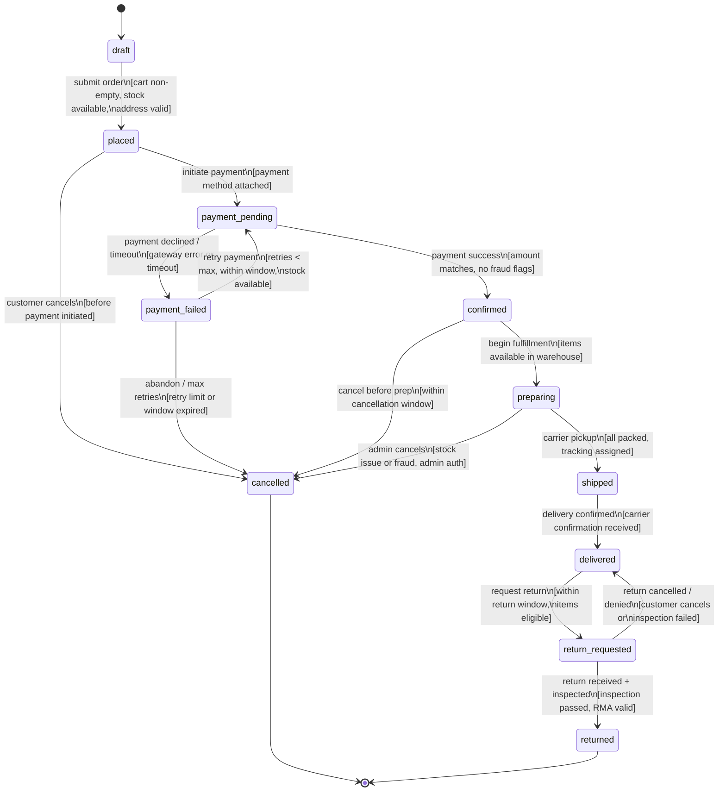
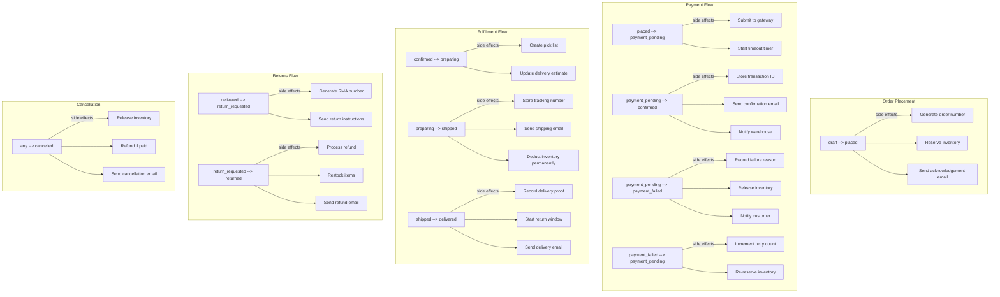
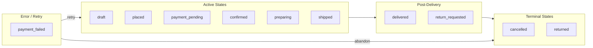

# E-Commerce Order State Machine Diagram

## Full Lifecycle

```mermaid
stateDiagram-v2
    [*] --> draft

    draft --> placed : submit order\n[cart non-empty, stock available,\naddress valid]

    placed --> payment_pending : initiate payment\n[payment method attached]
    placed --> cancelled : customer cancels\n[before payment initiated]

    payment_pending --> confirmed : payment success\n[amount matches, no fraud flags]
    payment_pending --> payment_failed : payment declined / timeout\n[gateway error or timeout]

    payment_failed --> payment_pending : retry payment\n[retries < max, within window,\nstock available]
    payment_failed --> cancelled : abandon / max retries\n[retry limit or window expired]

    confirmed --> preparing : begin fulfillment\n[items available in warehouse]
    confirmed --> cancelled : cancel before prep\n[within cancellation window]

    preparing --> shipped : carrier pickup\n[all packed, tracking assigned]
    preparing --> cancelled : admin cancels\n[stock issue or fraud, admin auth]

    shipped --> delivered : delivery confirmed\n[carrier confirmation received]

    delivered --> return_requested : request return\n[within return window,\nitems eligible]

    return_requested --> returned : return received + inspected\n[inspection passed, RMA valid]
    return_requested --> delivered : return cancelled / denied\n[customer cancels or\ninspection failed]

    cancelled --> [*]
    returned --> [*]
```

## Side Effects per Transition

```mermaid
flowchart TD
    subgraph "Order Placement"
        A[draft --> placed] -->|side effects| A1[Generate order number]
        A --> A2[Reserve inventory]
        A --> A3[Send acknowledgement email]
    end

    subgraph "Payment Flow"
        B[placed --> payment_pending] -->|side effects| B1[Submit to gateway]
        B --> B2[Start timeout timer]

        C[payment_pending --> confirmed] -->|side effects| C1[Store transaction ID]
        C --> C2[Send confirmation email]
        C --> C3[Notify warehouse]

        D[payment_pending --> payment_failed] -->|side effects| D1[Record failure reason]
        D --> D2[Release inventory]
        D --> D3[Notify customer]

        E[payment_failed --> payment_pending] -->|side effects| E1[Increment retry count]
        E --> E2[Re-reserve inventory]
    end

    subgraph "Fulfillment Flow"
        F[confirmed --> preparing] -->|side effects| F1[Create pick list]
        F --> F2[Update delivery estimate]

        G[preparing --> shipped] -->|side effects| G1[Store tracking number]
        G --> G2[Send shipping email]
        G --> G3[Deduct inventory permanently]

        H[shipped --> delivered] -->|side effects| H1[Record delivery proof]
        H --> H2[Start return window]
        H --> H3[Send delivery email]
    end

    subgraph "Returns Flow"
        I[delivered --> return_requested] -->|side effects| I1[Generate RMA number]
        I --> I2[Send return instructions]

        J[return_requested --> returned] -->|side effects| J1[Process refund]
        J --> J2[Restock items]
        J --> J3[Send refund email]
    end

    subgraph "Cancellation"
        K[any --> cancelled] -->|side effects| K1[Release inventory]
        K --> K2[Refund if paid]
        K --> K3[Send cancellation email]
    end
```

## State Categories

```mermaid
flowchart LR
    subgraph Active["Active States"]
        draft
        placed
        payment_pending
        confirmed
        preparing
        shipped
    end

    subgraph PostDelivery["Post-Delivery"]
        delivered
        return_requested
    end

    subgraph Terminal["Terminal States"]
        cancelled
        returned
    end

    subgraph ErrorRetry["Error / Retry"]
        payment_failed
    end

    Active --> PostDelivery
    PostDelivery --> Terminal
    ErrorRetry -->|retry| Active
    ErrorRetry -->|abandon| Terminal
```
