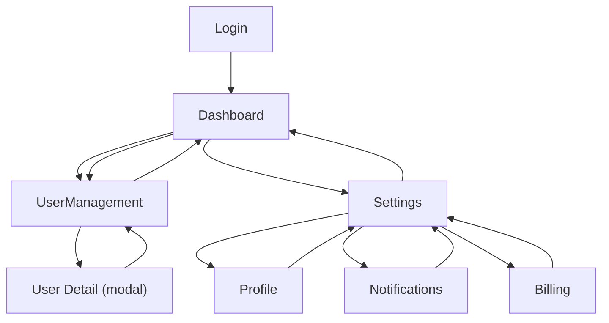

# Admin Dashboard — UI Wireframes

## Screen Inventory

| # | Screen | Route | Auth | Layout | Priority |
|---|--------|-------|------|--------|----------|
| 1 | Dashboard Overview | /admin/dashboard | Required | Dashboard | P0 |
| 2 | User Management | /admin/users | Required | Dashboard | P0 |
| 3 | Settings - Profile | /admin/settings/profile | Required | Dashboard | P1 |
| 4 | Settings - Notifications | /admin/settings/notifications | Required | Dashboard | P1 |
| 5 | Settings - Billing | /admin/settings/billing | Required | Dashboard | P1 |

---

## Navigation Flow



---

## Screen: Dashboard Overview (/admin/dashboard)
**Purpose:** Give admins an at-a-glance view of key performance indicators and recent system activity
**Auth:** Required
**Layout:** Dashboard
**Priority:** P0 (launch-critical)

### Wireframe
```
┌─────────────────────────────────────────────────────────────────────┐
│  Logo    [Dashboard] [Users] [Settings]              [Bell] [Avatar]│ <- Header (sticky)
├────────┬────────────────────────────────────────────────────────────┤
│        │                                                            │
│ [Dash] │  Dashboard Overview                          [Date Range] │
│ [Users]│  ─────────────────────────────────────────────             │
│ [Sett] │  ┌───────────┐ ┌───────────┐ ┌───────────┐ ┌───────────┐ │
│        │  │ Total     │ │ Active    │ │ Revenue   │ │ Conversion│ │
│        │  │ Users     │ │ Sessions  │ │ (MRR)     │ │ Rate      │ │
│        │  │           │ │           │ │           │ │           │ │
│        │  │ 12,847    │ │ 1,024     │ │ $48,320   │ │ 3.2%     │ │
│        │  │ +12% ▲    │ │ -3% ▼    │ │ +8% ▲    │ │ +0.4% ▲  │ │
│        │  └───────────┘ └───────────┘ └───────────┘ └───────────┘ │
│        │                                                            │
│        │  Recent Activity                              [View All]  │
│        │  ─────────────────────────────────────────────             │
│        │  ┌────────────────────────────────────────────────────┐   │
│        │  │ [Avatar] John Doe upgraded to Pro Plan   2 min ago│   │
│        │  │ [Avatar] Jane Smith created new team     15 min ago│   │
│        │  │ [Avatar] API key generated by admin      1 hr ago │   │
│        │  │ [Avatar] Failed login attempt: user@...  2 hr ago │   │
│        │  │ [Avatar] New user registration: alex@... 3 hr ago │   │
│        │  │ [Avatar] Payment received: $99.00        4 hr ago │   │
│        │  │ [Avatar] User role changed: editor→admin 5 hr ago │   │
│        │  │ [Avatar] Bulk export completed           6 hr ago │   │
│        │  └────────────────────────────────────────────────────┘   │
│        │                                                            │
│ Sidebar│  Content Area                                              │
└────────┴────────────────────────────────────────────────────────────┘
```

### Components
| Component | Type | Data Source | User Actions |
|-----------|------|-------------|--------------|
| Header | Shared | auth context | logout, profile, notifications |
| Sidebar | Shared | navigation config | route change, collapse/expand |
| KPI Card - Total Users | Feature | GET /api/admin/metrics/users | click -> Users screen |
| KPI Card - Active Sessions | Feature | GET /api/admin/metrics/sessions | click -> Sessions detail |
| KPI Card - Revenue | Feature | GET /api/admin/metrics/revenue | click -> Billing screen |
| KPI Card - Conversion Rate | Feature | GET /api/admin/metrics/conversion | click -> Analytics detail |
| Date Range Picker | Input | -- | filter all KPI data by date range |
| Activity Feed | Feature | GET /api/admin/activity?limit=8 | scroll to load more, click -> detail |
| View All Link | Action | -- | navigates to /admin/activity |
| Notification Bell | Action | GET /api/admin/notifications/unread | opens notification dropdown |

### States
| State | Display |
|-------|---------|
| Loading | 4 skeleton KPI cards with shimmer + 8 skeleton activity rows with shimmer animation |
| Empty | KPI cards show "0" values + Activity feed shows illustration + "No activity yet" message |
| Error | Toast notification "Failed to load dashboard data" with retry button |
| Loaded | 4 KPI cards with values, trends, and sparklines + scrollable activity feed |

### Responsive Breakpoints
| Breakpoint | Layout Change |
|-----------|--------------|
| Desktop (>=1024px) | Sidebar visible, 4-column KPI grid, activity feed full width |
| Tablet (768-1023px) | Sidebar collapsible, 2-column KPI grid (2x2), activity feed full width |
| Mobile (<768px) | Sidebar -> hamburger menu, 1-column KPI stack, activity feed full width with compact rows |

### Interaction: Date Range Filter
1. User clicks date range picker
2. Dropdown shows preset options: Today, Last 7 Days, Last 30 Days, Last 90 Days, Custom
3. User selects a range -> all KPI cards and activity feed refresh
   - Loading: KPI values show inline spinner, activity feed shows skeleton
   - Success: Data updates with smooth number transition animation
   - Error: Toast "Failed to load data for selected range" with retry
4. Custom range opens calendar picker with start/end date inputs

### Interaction: Activity Feed Item Click
1. User clicks an activity feed row
2. Navigation to the relevant detail view (user profile, billing record, etc.)
3. If the detail context is unavailable, toast notification "Record not found"

### Accessibility Notes
- Tab order: Date Range Picker -> KPI Cards (left to right) -> View All -> Activity Feed items -> Sidebar
- KPI cards have role="region" with aria-label="[metric name]: [value], [trend]"
- Activity feed items have role="listitem" with aria-label describing the event
- Trend indicators use icons AND text ("+12%" not just color/arrow)
- Date range picker is keyboard accessible with arrow keys for calendar navigation
- Focus ring visible on all interactive elements (2px solid primary-500)

---

## Screen: User Management (/admin/users)
**Purpose:** View, search, filter, and manage all users in the system with bulk operations
**Auth:** Required
**Layout:** Dashboard
**Priority:** P0 (launch-critical)

### Wireframe
```
┌─────────────────────────────────────────────────────────────────────┐
│  Logo    [Dashboard] [Users] [Settings]              [Bell] [Avatar]│ <- Header (sticky)
├────────┬────────────────────────────────────────────────────────────┤
│        │                                                            │
│ [Dash] │  User Management                              [+ Add User]│
│ [Users]│  ─────────────────────────────────────────────             │
│ [Sett] │                                                            │
│        │  ┌─────────────────────────┐  [Role ▼] [Status ▼] [Reset] │
│        │  │ 🔍 Search users...      │                               │
│        │  └─────────────────────────┘                               │
│        │                                                            │
│        │  [Bulk Actions ▼]  3 selected          Showing 1-25 of 847│
│        │  ┌──┬────────────┬──────────┬────────┬────────┬──────────┐│
│        │  │[]│ Name       │ Email    │ Role   │ Status │ Actions  ││
│        │  ├──┼────────────┼──────────┼────────┼────────┼──────────┤│
│        │  │[x]│ John Doe  │ john@... │ Admin  │ Active │ [..] [x] ││
│        │  │[x]│ Jane Smith│ jane@... │ Editor │ Active │ [..] [x] ││
│        │  │[x]│ Bob Jones │ bob@...  │ Viewer │Inactive│ [..] [x] ││
│        │  │[ ]│ Alice Wu  │ alice@...│ Editor │ Active │ [..] [x] ││
│        │  │[ ]│ Tom Brown │ tom@...  │ Viewer │Pending │ [..] [x] ││
│        │  │[ ]│ Sara Lee  │ sara@... │ Admin  │ Active │ [..] [x] ││
│        │  └──┴────────────┴──────────┴────────┴────────┴──────────┘│
│        │                                                            │
│        │           [< Prev]  1  2  3 ... 34  [Next >]              │
│        │                                                            │
│ Sidebar│  Content Area                                              │
└────────┴────────────────────────────────────────────────────────────┘
```

### Components
| Component | Type | Data Source | User Actions |
|-----------|------|-------------|--------------|
| Header | Shared | auth context | logout, profile, notifications |
| Sidebar | Shared | navigation config | route change |
| Search Bar | Input | -- | debounced search (300ms), filters table by name/email |
| Role Filter | Input | GET /api/admin/roles | filter table by role (Admin, Editor, Viewer) |
| Status Filter | Input | enum: Active, Inactive, Pending | filter table by status |
| Reset Filters | Action | -- | clears all filters and search |
| Add User Button | Action | -- | opens Add User modal |
| User Table | Feature | GET /api/admin/users?page=1&limit=25 | sort by column header click |
| Checkbox (per row) | Input | -- | select row for bulk actions |
| Select All Checkbox | Input | -- | select/deselect all visible rows |
| Edit Button [..] | Action | -- | opens Edit User modal |
| Delete Button [x] | Action | -- | triggers delete confirmation |
| Bulk Actions Dropdown | Action | -- | Deactivate Selected, Delete Selected, Change Role, Export CSV |
| Pagination | Navigation | total count from API | page navigation |

### States
| State | Display |
|-------|---------|
| Loading | Table skeleton with 6 shimmer rows, filters disabled |
| Empty | Illustration + "No users found" + "Invite your first user" CTA button |
| Error | Error banner above table "Failed to load users" with retry button |
| Loaded | Table with data rows, sortable columns, active pagination |
| Filtered - No Results | Table area shows "No users match your filters" + Reset Filters link |

### Responsive Breakpoints
| Breakpoint | Layout Change |
|-----------|--------------|
| Desktop (>=1024px) | Sidebar visible, full table with all columns, inline actions |
| Tablet (768-1023px) | Sidebar collapsible, table hides Email column, actions in overflow menu |
| Mobile (<768px) | Sidebar -> hamburger menu, table -> card list view (one user per card), filters in collapsible panel |

### Interaction: Search Users
1. User types in search bar
2. Debounced 300ms delay before API call GET /api/admin/users?search=[query]
3. Table updates with matching results
   - Loading: Table shows subtle loading indicator in header row
   - Success: Rows update, "Showing X of Y" count refreshes
   - No results: "No users match '[query]'" with clear search link
   - Error: Toast "Search failed, please try again"
4. User clears search -> table returns to unfiltered state

### Interaction: Bulk Actions
1. User selects rows via checkboxes (count updates: "3 selected")
2. User clicks Bulk Actions dropdown
3. Options shown: Deactivate Selected, Delete Selected, Change Role, Export CSV
4. User selects "Delete Selected"
5. Confirmation dialog: "Delete 3 users? This action cannot be undone."
6. User confirms -> API call DELETE /api/admin/users/bulk with selected IDs
   - Success: Rows removed with fade animation, success toast "3 users deleted"
   - Partial failure: Toast "2 of 3 users deleted. 1 failed." with details
   - Error: Error toast with retry, rows remain
7. User cancels -> dialog closes, selection preserved

### Interaction: Delete Single User
1. User clicks delete icon [x] on a row
2. Confirmation dialog: "Delete [user name]? This cannot be undone."
3. User confirms -> API call DELETE /api/admin/users/:id
   - Success: Row removed with fade animation, success toast
   - Error: Error toast with retry, row stays
4. User cancels -> dialog closes, no action

### Modal: Add User
```
┌──────────────────── Add User ────────────────────────┐
│                                                 [X]  │
│  Full Name *                                         │
│  ┌─────────────────────────────────────────┐         │
│  │                                         │         │
│  └─────────────────────────────────────────┘         │
│                                                      │
│  Email Address *                                     │
│  ┌─────────────────────────────────────────┐         │
│  │                                         │         │
│  └─────────────────────────────────────────┘         │
│                                                      │
│  Role *                                              │
│  ┌──────────────┐                                    │
│  │ Select...  ▼ │                                    │
│  └──────────────┘                                    │
│                                                      │
│  [ ] Send invitation email                           │
│                                                      │
│                   [Cancel]  [Add User]                │
└──────────────────────────────────────────────────────┘

Form Validation:
- Full Name: required, max 100 chars
- Email: required, valid email format, unique (server-side check)
- Role: required, select from enum (Admin, Editor, Viewer)
- Send invitation: optional, defaults to checked
- Submit disabled until all required fields valid
```

### Accessibility Notes
- Tab order: Search -> Role Filter -> Status Filter -> Reset -> Add User -> Select All -> Table rows -> Pagination
- Table has role="grid" with aria-label="User management table"
- Sort indicators use aria-sort="ascending" / "descending" on column headers
- Bulk actions dropdown has aria-expanded and aria-haspopup attributes
- Delete button has aria-label="Delete [user name]"
- Checkbox has aria-label="Select [user name]"
- Status badges use icons AND text (not just color)
- Modal traps focus, returns focus to trigger button on close
- Focus ring visible on all interactive elements (2px solid primary-500)

---

## Screen: Settings (/admin/settings)
**Purpose:** Manage admin profile information, notification preferences, and billing configuration through a tabbed interface
**Auth:** Required
**Layout:** Dashboard
**Priority:** P1 (important)

### Wireframe — Profile Tab (/admin/settings/profile)
```
┌─────────────────────────────────────────────────────────────────────┐
│  Logo    [Dashboard] [Users] [Settings]              [Bell] [Avatar]│ <- Header (sticky)
├────────┬────────────────────────────────────────────────────────────┤
│        │                                                            │
│ [Dash] │  Settings                                                  │
│ [Users]│  ─────────────────────────────────────────────             │
│ [Sett] │  [Profile]  [Notifications]  [Billing]   <- Tabs          │
│        │  ═══════                                                   │
│        │                                                            │
│        │  Profile Photo                                             │
│        │  ┌──────────┐                                              │
│        │  │          │  [Upload New]  [Remove]                      │
│        │  │  Avatar  │                                              │
│        │  │          │                                              │
│        │  └──────────┘                                              │
│        │                                                            │
│        │  Full Name *              Display Name                     │
│        │  ┌──────────────┐         ┌──────────────┐                │
│        │  │ John Doe     │         │ johndoe      │                │
│        │  └──────────────┘         └──────────────┘                │
│        │                                                            │
│        │  Email Address *          Phone                            │
│        │  ┌──────────────┐         ┌──────────────┐                │
│        │  │ john@acme.co │         │ +1 555-0100  │                │
│        │  └──────────────┘         └──────────────┘                │
│        │                                                            │
│        │  Timezone *                                                │
│        │  ┌─────────────────────────────────┐                      │
│        │  │ America/New_York (UTC-5)      ▼ │                      │
│        │  └─────────────────────────────────┘                      │
│        │                                                            │
│        │                        [Cancel]  [Save Changes]            │
│        │                                                            │
│ Sidebar│  Content Area                                              │
└────────┴────────────────────────────────────────────────────────────┘
```

### Components — Profile Tab
| Component | Type | Data Source | User Actions |
|-----------|------|-------------|--------------|
| Header | Shared | auth context | logout, profile, notifications |
| Sidebar | Shared | navigation config | route change |
| Tab Bar | Navigation | route param | switch between Profile, Notifications, Billing |
| Profile Photo | Feature | GET /api/admin/profile | display current avatar |
| Upload Button | Action | -- | opens file picker (jpg, png, max 5MB) |
| Remove Button | Action | DELETE /api/admin/profile/avatar | removes current avatar |
| Full Name Input | Input | GET /api/admin/profile | edit name |
| Display Name Input | Input | GET /api/admin/profile | edit display name |
| Email Input | Input | GET /api/admin/profile | edit email (triggers verification) |
| Phone Input | Input | GET /api/admin/profile | edit phone number |
| Timezone Select | Input | GET /api/admin/timezones | change timezone |
| Cancel Button | Action | -- | revert unsaved changes |
| Save Button | Action | PUT /api/admin/profile | save all changes |

### Wireframe — Notifications Tab (/admin/settings/notifications)
```
┌─────────────────────────────────────────────────────────────────────┐
│  Logo    [Dashboard] [Users] [Settings]              [Bell] [Avatar]│ <- Header (sticky)
├────────┬────────────────────────────────────────────────────────────┤
│        │                                                            │
│ [Dash] │  Settings                                                  │
│ [Users]│  ─────────────────────────────────────────────             │
│ [Sett] │  [Profile]  [Notifications]  [Billing]   <- Tabs          │
│        │              ═══════════════                               │
│        │                                                            │
│        │  Email Notifications                                       │
│        │  ─────────────────────────────────────────────             │
│        │  ┌────────────────────────────────────────────────────┐   │
│        │  │ New user registrations              [Toggle: ON ]  │   │
│        │  │ Get notified when a new user signs up              │   │
│        │  ├────────────────────────────────────────────────────┤   │
│        │  │ Failed login attempts               [Toggle: ON ]  │   │
│        │  │ Alert on 3+ failed logins for any account          │   │
│        │  ├────────────────────────────────────────────────────┤   │
│        │  │ Payment events                      [Toggle: OFF]  │   │
│        │  │ Subscription upgrades, downgrades, and failures    │   │
│        │  ├────────────────────────────────────────────────────┤   │
│        │  │ Weekly summary report               [Toggle: ON ]  │   │
│        │  │ Aggregated metrics delivered every Monday           │   │
│        │  └────────────────────────────────────────────────────┘   │
│        │                                                            │
│        │  Push Notifications                                        │
│        │  ─────────────────────────────────────────────             │
│        │  ┌────────────────────────────────────────────────────┐   │
│        │  │ Critical alerts                     [Toggle: ON ]  │   │
│        │  │ System downtime, security breaches                 │   │
│        │  ├────────────────────────────────────────────────────┤   │
│        │  │ Task assignments                    [Toggle: OFF]  │   │
│        │  │ When a task is assigned to you                     │   │
│        │  └────────────────────────────────────────────────────┘   │
│        │                                                            │
│        │                        [Cancel]  [Save Preferences]        │
│        │                                                            │
│ Sidebar│  Content Area                                              │
└────────┴────────────────────────────────────────────────────────────┘
```

### Components — Notifications Tab
| Component | Type | Data Source | User Actions |
|-----------|------|-------------|--------------|
| Tab Bar | Navigation | route param | switch tabs |
| Email Notification Toggles | Input | GET /api/admin/notifications/preferences | toggle on/off per category |
| Push Notification Toggles | Input | GET /api/admin/notifications/preferences | toggle on/off per category |
| Cancel Button | Action | -- | revert unsaved changes |
| Save Preferences Button | Action | PUT /api/admin/notifications/preferences | persist all toggle states |

### Wireframe — Billing Tab (/admin/settings/billing)
```
┌─────────────────────────────────────────────────────────────────────┐
│  Logo    [Dashboard] [Users] [Settings]              [Bell] [Avatar]│ <- Header (sticky)
├────────┬────────────────────────────────────────────────────────────┤
│        │                                                            │
│ [Dash] │  Settings                                                  │
│ [Users]│  ─────────────────────────────────────────────             │
│ [Sett] │  [Profile]  [Notifications]  [Billing]   <- Tabs          │
│        │                                ═══════                     │
│        │                                                            │
│        │  Current Plan                                              │
│        │  ┌────────────────────────────────────────────────────┐   │
│        │  │ Pro Plan — $49/month                               │   │
│        │  │ Next billing date: April 15, 2026                  │   │
│        │  │                          [Change Plan] [Cancel Sub]│   │
│        │  └────────────────────────────────────────────────────┘   │
│        │                                                            │
│        │  Payment Method                                            │
│        │  ┌────────────────────────────────────────────────────┐   │
│        │  │ Visa ending in 4242         Exp: 12/2027           │   │
│        │  │                                    [Update Card]   │   │
│        │  └────────────────────────────────────────────────────┘   │
│        │                                                            │
│        │  Billing History                                [Download] │
│        │  ┌────────────┬──────────┬──────────┬─────────────────┐  │
│        │  │ Date       │ Amount   │ Status   │ Invoice         │  │
│        │  ├────────────┼──────────┼──────────┼─────────────────┤  │
│        │  │ Mar 15, 26 │ $49.00   │ Paid     │ [Download PDF]  │  │
│        │  │ Feb 15, 26 │ $49.00   │ Paid     │ [Download PDF]  │  │
│        │  │ Jan 15, 26 │ $49.00   │ Paid     │ [Download PDF]  │  │
│        │  │ Dec 15, 25 │ $29.00   │ Paid     │ [Download PDF]  │  │
│        │  └────────────┴──────────┴──────────┴─────────────────┘  │
│        │                                                            │
│ Sidebar│  Content Area                                              │
└────────┴────────────────────────────────────────────────────────────┘
```

### Components — Billing Tab
| Component | Type | Data Source | User Actions |
|-----------|------|-------------|--------------|
| Tab Bar | Navigation | route param | switch tabs |
| Current Plan Card | Feature | GET /api/admin/billing/subscription | view plan details |
| Change Plan Button | Action | -- | opens plan selection modal |
| Cancel Subscription Button | Action | -- | triggers cancellation confirmation flow |
| Payment Method Card | Feature | GET /api/admin/billing/payment-method | view card on file |
| Update Card Button | Action | -- | opens Stripe/payment provider card update modal |
| Billing History Table | Feature | GET /api/admin/billing/invoices | view past invoices |
| Download PDF Link | Action | GET /api/admin/billing/invoices/:id/pdf | download individual invoice |
| Download All Button | Action | GET /api/admin/billing/invoices/export | download all invoices as CSV/ZIP |

### States — Settings (all tabs)
| State | Display |
|-------|---------|
| Loading | Form fields show skeleton placeholders with shimmer animation |
| Empty | Profile: fields empty with placeholder text. Notifications: all toggles default OFF. Billing: "No subscription" + "Choose a Plan" CTA |
| Error | Toast notification "Failed to load settings" with retry button |
| Loaded | All fields populated with current values, save button disabled until changes made |
| Saving | Save button shows spinner + "Saving..." text, all inputs disabled |
| Saved | Success toast "Settings saved successfully", save button returns to disabled state |
| Unsaved Changes | Browser beforeunload warning if navigating away, save button enabled |

### Responsive Breakpoints — Settings (all tabs)
| Breakpoint | Layout Change |
|-----------|--------------|
| Desktop (>=1024px) | Sidebar visible, 2-column form layout for name/email fields, full-width billing table |
| Tablet (768-1023px) | Sidebar collapsible, 2-column form layout preserved, billing table scrolls horizontally |
| Mobile (<768px) | Sidebar -> hamburger menu, 1-column form stack, tabs -> horizontal scrollable pills, billing table -> card list per invoice |

### Interaction: Save Profile
1. User modifies any field (save button becomes enabled)
2. User clicks "Save Changes"
3. Client-side validation runs
   - Validation failure: inline error messages below invalid fields, save button stays enabled
4. API call PUT /api/admin/profile
   - Saving: button shows spinner "Saving...", inputs disabled
   - Success: Toast "Profile updated successfully", button returns to disabled
   - Error: Toast "Failed to save profile" with retry, inputs re-enabled
5. If email changed, confirmation toast "Verification email sent to [new email]"

### Interaction: Cancel Subscription
1. User clicks "Cancel Subscription" on Billing tab
2. Confirmation dialog: "Cancel your Pro Plan? You'll retain access until April 15, 2026."
3. Optional: Reason selection dropdown (Too expensive, Not using it, Switching, Other)
4. User confirms -> API call POST /api/admin/billing/cancel
   - Success: Plan card updates to show "Cancels on April 15, 2026", button changes to "Reactivate"
   - Error: Toast "Failed to cancel subscription. Please contact support."
5. User clicks "Keep Plan" -> dialog closes, no action

### Interaction: Upload Profile Photo
1. User clicks "Upload New"
2. OS file picker opens (accepts jpg, png, webp; max 5MB)
3. User selects file -> preview appears in avatar area
4. API call POST /api/admin/profile/avatar (multipart form)
   - Uploading: Progress indicator on avatar
   - Success: Avatar updates, toast "Photo updated"
   - Too large: Toast "File must be under 5MB"
   - Wrong format: Toast "Please upload a JPG, PNG, or WebP image"
   - Error: Toast "Upload failed" with retry

### Accessibility Notes — Settings
- Tab bar uses role="tablist" with aria-selected on active tab
- Each tab panel has role="tabpanel" with aria-labelledby pointing to its tab
- Toggle switches have role="switch" with aria-checked state
- Notification descriptions are linked via aria-describedby to their toggle
- Save button has aria-disabled="true" when no changes are made
- Cancel subscription dialog traps focus and returns focus on close
- Billing table has proper th scope="col" for column headers
- Invoice download links have aria-label="Download invoice for [date]"
- Focus ring visible on all interactive elements (2px solid primary-500)
- Tab order within Settings: Tab Bar -> Form fields (top to bottom, left to right) -> Cancel -> Save

---

## Checklist

- [x] Every screen has a wireframe with ASCII layout
- [x] All components listed with data sources and user actions
- [x] All 4 states specified (loading, empty, error, loaded)
- [x] Responsive breakpoints defined (mobile, tablet, desktop)
- [x] Navigation flow documented with Mermaid diagram
- [x] Interactive elements have interaction specifications
- [x] Forms show validation rules and error placement
- [x] Accessibility annotations included (tab order, aria labels, focus management)
- [x] Screen inventory created for new applications
