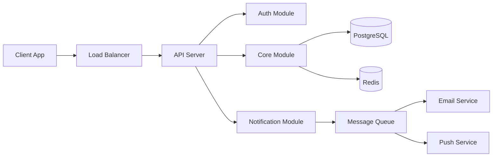

# System Architect Skill

Design production-grade system architecture with clear diagrams and rationale.

## Architecture Decision Process

1. **Understand the constraints** — scale, team size, timeline, budget
2. **Choose the pattern** — monolith, modular monolith, microservices, serverless
3. **Define module boundaries** — by domain, by team, by deployment unit
4. **Design data flow** — request lifecycle, event flow, data pipeline
5. **Plan infrastructure** — hosting, databases, caches, CDN, monitoring
6. **Document decisions** — ADRs with rationale

## Pattern Selection Guide

| Factor | Monolith | Modular Monolith | Microservices | Serverless |
|--------|----------|------------------|---------------|------------|
| Team Size | 1-5 | 3-15 | 10+ | 1-10 |
| Timeline | Fast delivery | Balanced | Long-term | Fast + scalable |
| Complexity | Low-Med | Medium | High | Medium |
| Scale | Thousands | Tens of thousands | Millions | Variable |
| Deploy | Simple | Simple | Complex | Auto |
| Cost | Low | Low-Med | High | Pay-per-use |

**Default recommendation:** Start with **Modular Monolith** unless you have a specific reason not to. You can extract microservices later.

## Architecture Document Template

```markdown
# [Project] — Architecture

## System Overview
[High-level description]

## Architecture Diagram


## Module Boundaries
| Module | Responsibility | Dependencies | Data Ownership |
|--------|---------------|-------------|----------------|
| Auth | Authentication, authorization, sessions | None | users, sessions |
| Core | Business logic, CRUD operations | Auth | [entities] |
| Notify | Email, push, SMS notifications | Core | notifications |

## Data Flow
### Request Lifecycle
1. Client sends request → Load Balancer
2. LB routes to API Server
3. Auth middleware validates JWT
4. Route handler delegates to service
5. Service executes business logic
6. Repository queries database
7. Response returned to client

## Infrastructure
| Component | Technology | Hosting | Purpose |
|-----------|-----------|---------|---------|
| API | [framework] | [platform] | Request handling |
| Database | PostgreSQL 18+ | [provider] | Primary data store |
| Cache | Redis 8+ | [provider] | Session + query cache |
| CDN | [provider] | Edge | Static assets |
| CI/CD | GitHub Actions | GitHub | Build + deploy |

## Scaling Strategy
- **Vertical:** Increase instance size for immediate relief
- **Horizontal:** Add instances behind load balancer
- **Database:** Read replicas for read-heavy workloads
- **Cache:** Redis cluster for session + query caching
- **Queue:** Message queue for async operations
```

## Architecture Decision Record (ADR) Template
```markdown
# ADR-[NNN]: [Title]
**Status:** Proposed | Accepted | Deprecated | Superseded
**Date:** [YYYY-MM-DD]
**Context:** [What is the issue?]
**Decision:** [What was decided]
**Rationale:** [Why this option over alternatives]
**Alternatives Considered:**
1. [Option A] — [why rejected]
2. [Option B] — [why rejected]
**Consequences:**
- [Positive consequence]
- [Negative consequence / trade-off]
```

## Anti-Patterns

- **Microservices by default** — starting with microservices when the team is small (< 5 devs) or the domain is unclear; start with a modular monolith and extract services only when you have a clear reason (independent scaling, team ownership)
- **Shared database across services** — microservices sharing a single database couples them at the data layer; each service should own its data and expose it via API
- **No ADRs** — making architecture decisions without documenting the rationale; six months later nobody remembers why gRPC was chosen over REST
- **Resume-driven architecture** — picking technologies because they look good on a resume rather than because they solve the actual problem
- **Ignoring team size** — designing for 10 teams when you have 2 developers; architecture should match organizational capacity
- **No data flow diagram** — designing components without tracing how a request flows through the system end-to-end; missing data flows hide coupling

## Checklist

- [ ] Architecture pattern chosen (monolith / modular monolith / microservices) with documented rationale
- [ ] Module/service boundaries defined by domain, not by technical layer
- [ ] Data flow diagram traces request lifecycle from client to database and back
- [ ] Infrastructure topology diagram shows all services, databases, caches, and queues
- [ ] Communication patterns defined (REST, gRPC, events) for each service boundary
- [ ] ADR written for every significant decision (database choice, auth strategy, hosting)
- [ ] Mermaid diagrams included (architecture overview + data flow)
- [ ] Non-functional requirements addressed (scale, latency, availability targets)
- [ ] Output saved to `.claude/specs/[feature]/architecture.md`
