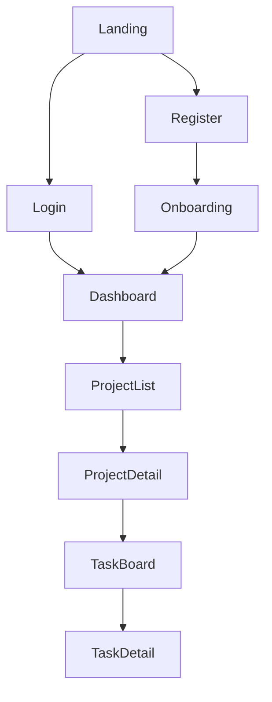

# UI Wireframes Skill

Create structured UI specifications that agents can implement directly. Wireframes define layout, components, data sources, interactions, and responsive behavior — everything a developer needs to build the screen without guessing.

## When to Use

- Designing a new screen or page layout before implementation
- Planning navigation flows across multiple screens
- Documenting component specifications for a feature
- Creating responsive layout breakpoints
- Specifying interaction states (loading, empty, error, hover, focus)
- Building a screen inventory for a new application

## Screen Layout Template

```markdown
## Screen: [Name] (/route/path)
**Purpose:** [What the user accomplishes here]
**Auth:** Required | Public
**Layout:** Dashboard | Auth | Full-width | Modal
**Priority:** P0 (launch-critical) | P1 (important) | P2 (nice-to-have)

### Wireframe
┌─────────────────────────────────────────┐
│  Logo    [Nav Item] [Nav Item]  [Avatar]│ ← Header (sticky)
├────────┬────────────────────────────────┤
│        │                                │
│ [Link] │  Page Title           [+ New]  │
│ [Link] │  ─────────────────────────     │
│ [Link] │  ┌──────┐ ┌──────┐ ┌──────┐   │
│ [Link] │  │Card 1│ │Card 2│ │Card 3│   │
│        │  └──────┘ └──────┘ └──────┘   │
│        │                                │
│Sidebar │  Content Area                  │
└────────┴────────────────────────────────┘

### Components
| Component | Type | Data Source | User Actions |
|-----------|------|-----------|-------------|
| Header | Shared | auth context | logout, profile |
| Sidebar | Shared | navigation config | route change |
| Card Grid | Feature | GET /api/items | click → detail, delete |
| New Button | Action | — | opens create modal |
| Search Bar | Input | — | filters card grid |

### States
| State | Display |
|-------|---------|
| Loading | 3 skeleton cards with shimmer animation |
| Empty | Illustration + "No items yet" + "Create your first one" CTA |
| Error | Toast notification with retry button |
| Loaded | Cards in 3-column grid (responsive) |

### Responsive Breakpoints
| Breakpoint | Layout Change |
|-----------|--------------|
| Desktop (≥1024px) | Sidebar visible, 3-column card grid |
| Tablet (768-1023px) | Sidebar collapsible, 2-column grid |
| Mobile (<768px) | Sidebar → hamburger menu, 1-column stack |
```

## Navigation Flow (Mermaid)



## Interaction Specification

For each interactive component, document the interaction flow:

```markdown
### Interaction: Delete Item
1. User clicks delete icon on card
2. Confirmation dialog appears: "Delete [item name]? This cannot be undone."
3. User confirms → API call DELETE /api/items/:id
   - Success: Card removed with fade animation, success toast
   - Error: Error toast with retry, card stays
4. User cancels → dialog closes, no action

### Interaction: Inline Edit
1. User double-clicks item title
2. Title becomes editable text input (auto-focused, text selected)
3. User presses Enter or clicks away → save (PUT /api/items/:id)
4. User presses Escape → cancel, revert to original text
```

## Modal and Form Wireframes

```
┌─────────────── Create Product ──────────────────┐
│                                            [X]  │
│  Product Name *                                  │
│  ┌─────────────────────────────────────────┐    │
│  │                                         │    │
│  └─────────────────────────────────────────┘    │
│                                                  │
│  Category *              Price *                 │
│  ┌──────────────┐  ┌──────────────┐             │
│  │ Select...  ▼ │  │ $ 0.00       │             │
│  └──────────────┘  └──────────────┘             │
│                                                  │
│  Description                                     │
│  ┌─────────────────────────────────────────┐    │
│  │                                         │    │
│  │                                         │    │
│  └─────────────────────────────────────────┘    │
│  0/500 characters                                │
│                                                  │
│              [Cancel]  [Create Product]          │
└──────────────────────────────────────────────────┘

Form Validation:
- Name: required, max 100 chars
- Category: required, select from enum
- Price: required, positive number, 2 decimal places
- Description: optional, max 500 chars
- Submit disabled until all required fields valid
```

## Accessibility Annotations

Add accessibility notes to wireframes:

```markdown
### Accessibility Notes
- Tab order: Search → Filter tabs → Card grid → Pagination → Sidebar
- Cards have role="article" with aria-label="[item name]"
- Delete button has aria-label="Delete [item name]"
- Modal traps focus, returns focus to trigger on close
- Empty state illustration has alt="" (decorative)
- Color is never the only indicator (icons + labels for status)
- Focus ring visible on all interactive elements (2px solid primary-500)
```

## Screen Inventory Template

For new applications, start with a screen inventory:

```markdown
## Screen Inventory

| # | Screen | Route | Auth | Layout | Priority |
|---|--------|-------|------|--------|----------|
| 1 | Login | /login | Public | Auth | P0 |
| 2 | Register | /register | Public | Auth | P0 |
| 3 | Dashboard | /dashboard | Required | Dashboard | P0 |
| 4 | Product List | /products | Required | Dashboard | P0 |
| 5 | Product Detail | /products/:id | Required | Dashboard | P0 |
| 6 | Settings | /settings | Required | Dashboard | P1 |
| 7 | User Profile | /profile | Required | Dashboard | P1 |
```

## Anti-Patterns

- **Wireframes without states** — only showing the "loaded with data" state; every screen has at least 4 states (loading, empty, error, loaded)
- **Missing responsive breakpoints** — designing for desktop only; mobile layouts must be specified explicitly
- **No interaction details** — showing buttons without specifying what happens when clicked, including error and success paths
- **Pixel-perfect wireframes** — wireframes define layout and behavior, not exact spacing; leave visual design to the design system
- **No data source mapping** — components without API endpoints or data sources leave developers guessing where data comes from
- **Ignoring accessibility** — not specifying tab order, focus management, or screen reader labels; accessibility is a layout concern, not a polish step

## Checklist

- [ ] Every screen has a wireframe with ASCII layout
- [ ] All components listed with data sources and user actions
- [ ] All 4 states specified (loading, empty, error, loaded)
- [ ] Responsive breakpoints defined (mobile, tablet, desktop)
- [ ] Navigation flow documented with Mermaid diagram
- [ ] Interactive elements have interaction specifications
- [ ] Forms show validation rules and error placement
- [ ] Accessibility annotations included (tab order, aria labels, focus management)
- [ ] Screen inventory created for new applications
- [ ] Wireframes saved to `.claude/specs/[feature]/design.md`
